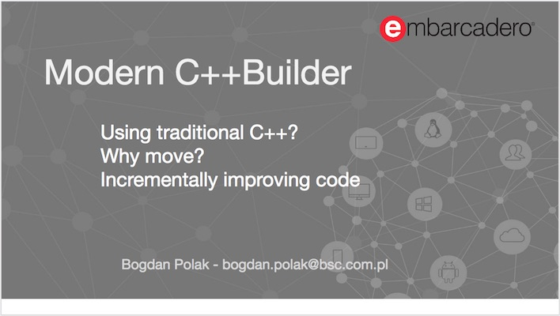

# Główne hasła warsztatu

1. Programowanie to praca zespołowa
	* Pracujemy razem
	* Uczymy się nowych rzeczy patrząc na kod innego programisty. 
	* Poznajemy dobre i sprawdzone praktyki. 
	* Ulepszamy kod i nie krytykujemy. 
	* Działający kod jest już dobry, ale może być lepszy (szczególnie w C++)
	* Repozytorium to podstawa
	* Dobre repozytorium to skarb
	* Nazewnictwo i formatowanie kodu
	* Czysty kod C++
	* Bezpieczny kod C++
	* Praca zespołowa w git - dokument `GitTeamwork.md` [zobacz](./GitTeamwork.md)
	* Czysty kod w C++ - dokument `CppCleanCode.md` [zobacz](./CppCleanCode.md)
2. Kopiowanie jest ekstra, ale reużywanie kodu jest jeszcze lepsze
	* Reużywanie wymaga więcej wysiłku
	* Dostajemy sprawdzony i bezpieczny kod (bibliotekę kodu)
	* Kopiowanie zazwyczaj wymaga korekty kodu.
	* Rozwój skopiowanego kodu wymaga uciążliwej synchronizacji
	* Błędy regresji
	* Zasady DRY
3. Kod spaghetti
	* C++Builder i VCL promują pisanie kodu wymieszanego
	* Syndrom "OnClick Developer"
		* Przykład: w jednym zdarzeniu (metodzie) wykonujemy operacje dotyczące wielu w logicznych warstwy, np. składowanie danych, analiza spójności, algorytmy numeryczne, wizualizacja danych, logowanie procesu, komunikacja z urządzaniami, itp.
	* Kod powstaje szybko, ale jest trudny do utrzymania
	* Ogromny wysiłek programisty
	* Kodowanie staje się mało kreatywne
	* Separacja modułów danych i odcinanie zbędnych zależności
	* Architektura projektu
	* Architektura w C++ - dokument `CppArchitecture.md` [zobacz](./CppArchitecture.md)
4. Nowoczesny kod C++
	* Wykorzystanie biblioteki STD
	* Głębsze poznanie możliwości języka C++
	* C++ to nie jest Delphi zapisane w nowacji C++
	* Wykorzystanie nowych elementów języka
	* Prezentacja na Google Doc `Modern CBuilder` 
	
	
